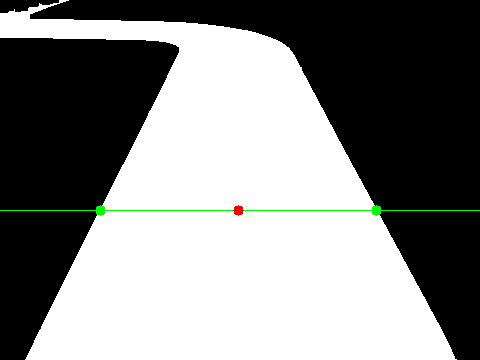

# Usage

`controller` takes `path` stream from `imaging` service as input and produces a `decision` output stream. 

## Input

`path` stream has the following format:
```
pb_output.SensorOutput{
    SensorId:  25,
    Timestamp: uint64(time.Now().UnixMilli()),
    SensorOutput: &pb_output.SensorOutput_CameraOutput{
        CameraOutput: &pb_output.CameraSensorOutput{
            DebugFrame: &pb_output.CameraSensorOutput_DebugFrame{
                Jpeg:   imgBytes.GetBytes(),
                Canvas: &canvas,
            },
            Trajectory: &pb_output.CameraSensorOutput_Trajectory{
                Points: trajectory_points,
                Width:  uint32(imgWidth),
                Height: uint32(imgHeight),
            },
        },
    },
}
```

`SensorOutput_CameraOutput` object contains a `CameraSensorOutput` object with 2 main fields:
1. `CameraSensorOutput_DebugFrame` containing:
    -  `Jpeg`, a (prerpocessed) acquired frame transmitted as a raw byte array of a JPEG image and the 
    - `canvas`, contains a `width` and `height` fields, as well as an array of `CanvasObject`s, which are either a `Line`, `Rectangle` or `Circle`. It can be used for example to overlay these shapes on top of the JPEG image. 

2. `CameraSensorOutput_Trajecotry` is composed of:
    - `trajectory_points` array of points supplied by the imaging (default implementation only passes 1 point to the array). 
    - `Width` of the acquired image. 
    - `Height` of the acquired image

### Processing input

Taken from `src/main.go`: 
```
imagingData := data.GetCameraOutput()
```
This unmarshals the `SensorOutput` object and returns a `CameraSensorOutput` object


```
trajectory := imagingData.GetTrajectory()
```
Next, we further process the input to extract a `CameraSensorOutput_Trajectory` object to further work with.

### how to use first point

The first point in the array of trajectory points is the identified middle of the visible part of the track. (see image below). You can, for example, compare value of its `x` coordinate to the middle of the frame to see if the car is offset towards the left or right side of the track.



## Controller

The default implementation of the `controller` service uses a PID algorithm to make a decision on where to go ([What is a PID controller?](https://en.wikipedia.org/wiki/Proportional–integral–derivative_controller)). It is very much the core of this service and is the primary part you would want to replace, should you decide to implement your own algorithm.

## Output

`controller` outputs the `decision` stream (see example below), which is later read and interpreted by the `actuator`.

```
actuatorOutput.Write(
    &pb_outputs.SensorOutput{
        SensorId:  2,
        Timestamp: uint64(time.Now().UnixMilli()),
        SensorOutput: &pb_outputs.SensorOutput_ControllerOutput{
            ControllerOutput: &pb_outputs.ControllerOutput{
                SteeringAngle: float32(steerValue),
                LeftThrottle:  float32(speed),
                RightThrottle: float32(speed),
                FrontLights:   false,
            },
        },
    },
)
```

`SensorOutput_ControllerOutput` contains a `ControllerOutput` object, composed of the following fields:

1. `SteeringAngle`, a `float32` value between -1 (left) and 1 (right)
2. `LeftThrottle`, a `float32` value between -1 (full reverse) and 1 (full forward)
3. `RightThrottle`, a `float32` value between -1 (full reverse) and 1 (full forward)
4. `FrontLights`, a `boolean` value previously used to turn on the front lights in the dark, currently not used

For seeing an example of using `decision` stream, please look at `actuator documentation`